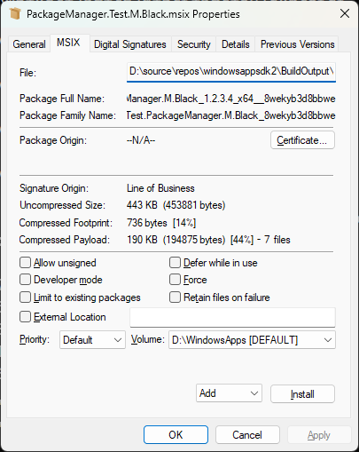
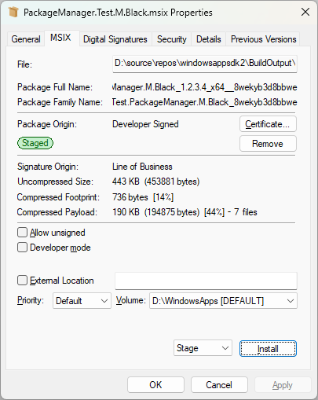
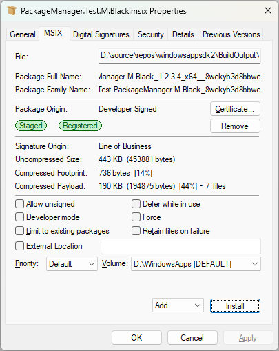
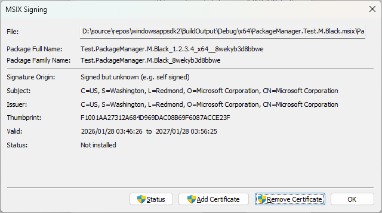

# MSIXcli

MSIX command-line utilities to access and manage MSIX packages.

This repository is based on various projects, musings, investigations and experimentation
to explore interesting, useful or simply neat ideas and scratch some personal itches. You'll
have to decide for yourself whether you find these tools useful or dead ends (or both).

# Requirements

- Windows 11 (aka >=21H2 aka >=10.0.22000.0)

# msix.exe

TBD

# msixadmin.exe

This command line executable provides access to MSIX functionality requiring admin privilege.

If not launched elevated you'll see a UAC prompt to allow elevation, or process creation will fail.
Nothing magical, just the usual Fusion manifest games (OK, perhaps that is a bit magical... :P).

Run `msixadmin --help` for more information.

## MSIX Property Sheet

Run

```cmd
msixadmin tool propertysheet install
```

to install the MSIX PropertySheet page. This shows a new `MSIX` tab in Explorer's property sheet for
MSIX files.

**NOTE**: Currently supports *.msix and *.appx. Bundles and more are on the TODO list.

### Screenshots

#1 MSIX tab for a new .msix file. Install button will Add the package.



#2 MSIX tab for a Staged package.



#3 MSIX tab for a Registered  package.



#4 Certificate dialog.



## Common Issues

1. **Handler not appearing**: Make sure the DLL is registered correctly
2. **Wrong architecture**: Match DLL architecture (x64/arm64) with Explorer process

# License

See the LICENSE file in the root directory.

# References

- [Implementing Shell Extension Handlers](https://docs.microsoft.com/en-us/windows/win32/shell/handlers)
- [IShellPropSheetExt Interface](https://docs.microsoft.com/en-us/windows/win32/api/shobjidl_core/nn-shobjidl_core-ishellpropsheetext)
- [Property Sheet Handlers](https://docs.microsoft.com/en-us/windows/win32/shell/propsheet-handlers)
